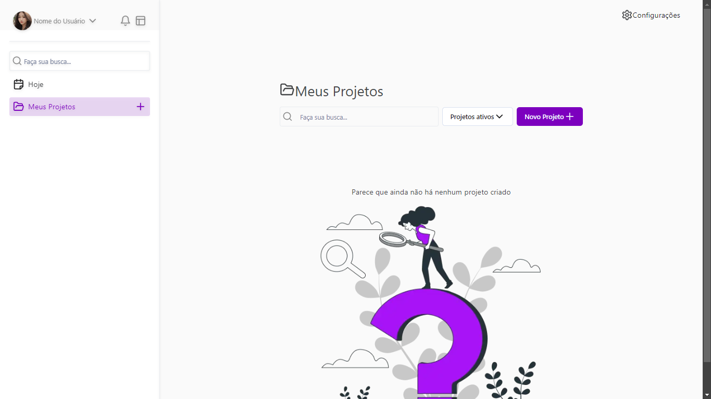
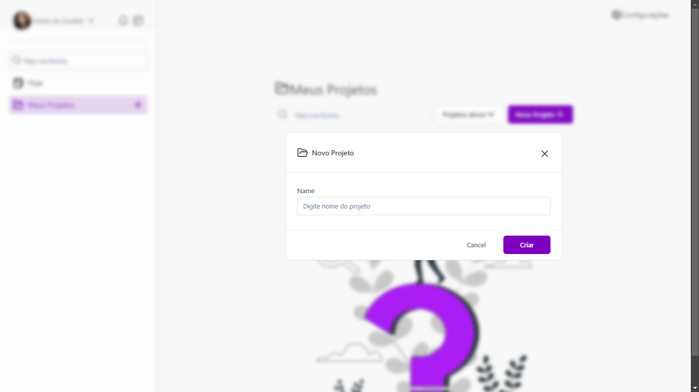

# Web Teste

## Índice

- [Visão Geral](#visão-geral)
  - [Imagens](#Imagens)
- [Funcionalidades](#funcionalidades)
- [Tecnologias Utilizadas](#tecnologias-utilizadas)
- [Começando](#começando)
  - [Pré-requisitos](#pré-requisitos)
  - [Instalação](#instalação)
  - [Executando o Projeto](#executando-o-projeto)
- [Deploy](#deploy)
- [Contribuindo](#contribuindo)
- [Contato](#contato)

## Visão Geral

[descrição]

## Imagens

Aqui estão algumas imagens do projeto:

<div>
    
    
</div>

## Funcionalidades

- [lista]

## Tecnologias Utilizadas

- [Next.js](https://nextjs.org/)
- [Tailwindcss](https://tailwindcss.com/)
- [shadcn_ui](https://ui.shadcn.com/)
- [React.js](https://reactjs.org/)
- [TypeScript](https://www.typescriptlang.org/)

## Começando

### Pré-requisitos

- Node.js
- npm

### Instalação

1. Clone o repositório:

   ```bash
   git clone []
   ```

2. Navegue até o diretório do projeto:

   ```bash
   cd []
   ```

3. Instale as dependências:

   ```bash
   npm install
   ```

4. Inicie o servidor de desenvolvimento:

   ```bash
   npm run dev
   ```

## Contribuindo

Contribuições são bem-vindas! Por favor, siga estas etapas para contribuir:

1. Faça um fork do repositório.
2. Crie uma nova branch (`git checkout -b feature/SuaFuncionalidade`).
3. Faça suas alterações.
4. Faça um commit das suas alterações (`git commit -m 'Adicionei uma nova funcionalidade'`).
5. Envie para a branch (`git push origin feature/SuaFuncionalidade`).
6. Crie um novo Pull Request.

## Contato

**Dalio Shindi Yamada**

- [GitHub](https://github.com/DalioSY)
- [LinkedIn](https://www.linkedin.com/in/dalio-s-yamada)
- [Portfólio](https://portfolio-dalio.vercel.app/)
